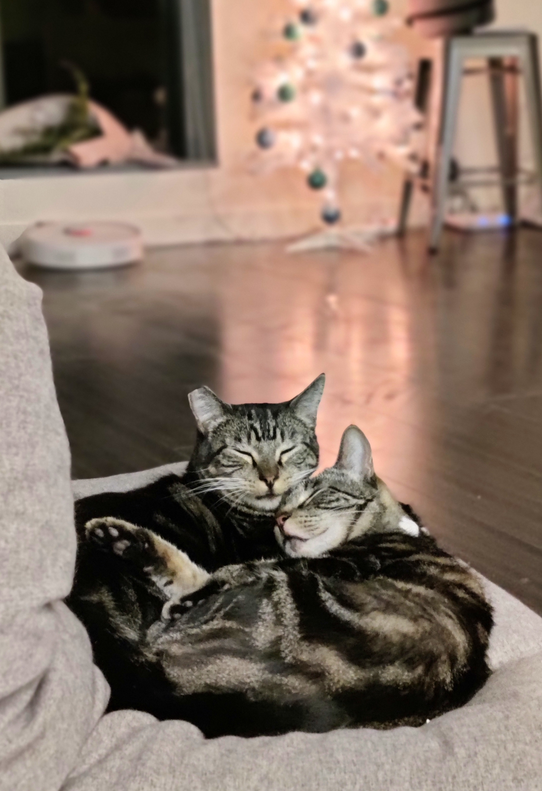
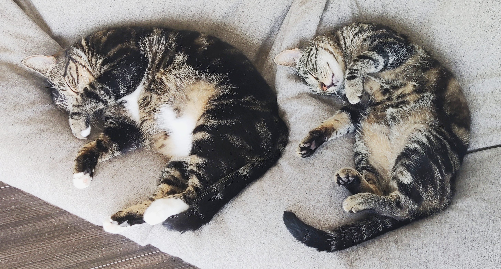

Hello! I am a master's student at University of Washington learning natural language processing. My advisors are [Ana Marasović](https://www.anamarasovic.com/) and [Noah A. Smith](https://homes.cs.washington.edu/~nasmith/).

Since I am still exploring, my interests are nascent. In general, I am interested in natural language processing. Currently, I am inquisitive in **devloping novel techniques to facilitate efficient, explanable NLP**. I also find **fairness and robustness** in NLP systems intriguing. 

I obtained my Bachelor's degrees of computer science (B.S.) and mathematics (B.A.) in the same school. During my undergraduate years, I worked with [Ana Marasović](https://www.anamarasovic.com/) on interpretability and [Christopher Hoffman](https://sites.math.washington.edu/~hoffman/) on dual random-walk systems. Thanks a lot to the support of my advisors and my donors, I was able to conduct research and keep learning.

`I have a limited amount of experiences investigating things in life, but if you are having questions on finding SDE/DS internships or applying for master/undergraduate programs and you think I can help, no matter what your background is, please do not hesitate to email me.`

News
======
**I am applying to PhD programs this fall, please wish me best of luck ⭐**
**[December 2021]** I am joinning AWS AI as an applied scientist intern this summer, trying to figure out my proposal for it these days; I began as a teaching assistant in [Natural Language Processing](https://nasmith.github.io/NLP-winter22/about/) at UW for winter quarter. 

**[September 2021]** I began as a teaching assistant in [Machine Learning](https://courses.cs.washington.edu/courses/csep546/21au/) at UW for fall quarter.

**[July 2021]** I began my software engineering internship in AuthService team at Amazon.

**[May 2021]** Our paper “[Effective Attention Sheds Light On Interpretability](https://arxiv.org/abs/2105.08855)” was accepted into Findings of ACL2021. Big thanks to Ana! 🌻

**[March 2021]** I finished my Bachelor's degrees 🤓 - B.S. in CS and B.A. in math, as well as a minor in classical studies; I began as a teaching assistant in [Enterprise Chatbots](https://courses.cs.washington.edu/courses/csep590b/) at UW for spring quarter.

  
<b>News before 2021</b>

  <b>[November 2020]</b> Joined <a href="https://noonum.ai">Noonum</a> as a data scientist intern.  

  <b>[July 2020]</b> I began my software engineering internship in AuthEngine team at Amazon. 
  
  <b>[September 2019]</b> Began a project on dual random-walk systems with Professor <a href="https://sites.math.washington.edu/~hoffman/">Christopher Hoffman</a> at Washington Experimental Mathematics Lab.  

  <b>[July 2019]</b> Began my internship at National Oceanic & Atmospheric Administration (NOAA) mentored by Dr. <a href="https://www.fisheries.noaa.gov/contact/jason-cope-phd">Jason Cope</a>.  

 

Cat Warning
======
I have two very cute cats: Bert (white collar with white paws) and Roberta (grey and looks like a little leopard). While you are browsing my website, I hope pictures of Bert and Roberta can make you feel happy and relaxed for a second.

