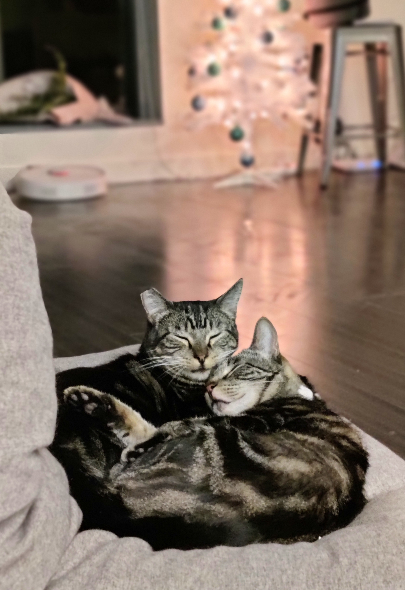
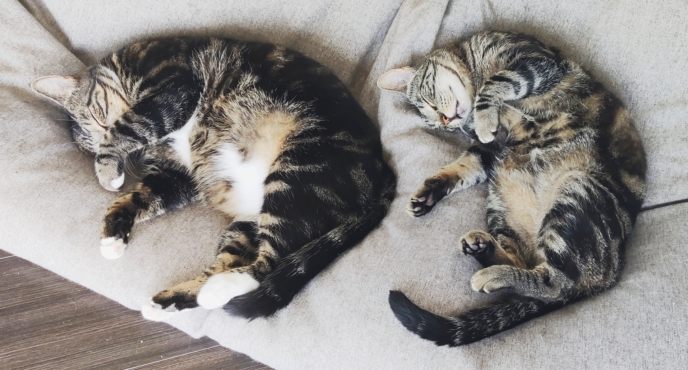

Hello! I am a PhD student at [JHU CLSP](https://www.clsp.jhu.edu/), advised by [Mark Dredze](https://www.cs.jhu.edu/~mdredze/).

My interests are protean due to my restless curiosity. I am generally interested in understanding how language models function and exploring how we can change them.
Terminologically, I am interested in studying interpretability (broadly), training dynamics, evaluation, and reasoning of language models.

Before my PhD studies, I was a resident at [FAIR Labs](https://ai.facebook.com/research/), working with [Adina Williams](https://ai.facebook.com/people/adina-williams) and [Dieuwke Hupkes](https://dieuwkehupkes.nl/). I obtained my Master's and Bachelor's degrees of computer science (B.S., M.S.) and mathematics (B.A.) with a minor in classical studies at University of Washington. My advisor was [Noah A. Smith](https://homes.cs.washington.edu/~nasmith/), and I was supervised by [Ana Marasović](https://www.anamarasovic.com/). I have also interned at the AWS AI Labs for two times, mentored by [Peng Qi](https://qipeng.me/), [Yuhao Zhang](https://yuhao.im/), [Jifan Chen](https://jifan-chen.github.io/), and [Danilo Ribeiro](https://dnr2.github.io/academic_website/).
During my undergraduate years, I also worked with [Christopher Hoffman](https://sites.math.washington.edu/~hoffman/) on dual random-walk systems. Thanks a lot to the support of my advisors and my donors, I was able to conduct research and keep learning.

I have a limited amount of life experiences, but if you are having questions and you think I can help, feel free to email me.

News
======

  [March 2026]
  
New paper 📄: <a href="https://arxiv.org/abs/2603.09095">Reading, Not Thinking: Understanding and Bridging the Modality Gap When Text Becomes Pixels in Multimodal LLMs</a> is now available on arXiv.

  [June 2025]
  
New paper 📄: <a href="https://arxiv.org/abs/2506.06485">Task Matters: Knowledge Requirements Shape LLM Responses to Context-Memory Conflict</a> is now available on arXiv.

  [May 2025]
  
New paper 📄: <a href="https://arxiv.org/abs/2505.10571">On the Failure of Latent State Persistence in Large Language Models</a> is now available on arXiv.

  [April 2025]
  
New papers 📄: <a href="https://arxiv.org/abs/2408.06663">Amuro and Char: Analyzing the Relationship between Pre-Training and Fine-Tuning of Large Language Models</a> is accepted into RepL4NLP2025; <a href="https://aclanthology.org/2025.naacl-long.600/">SHADES: Towards a Multilingual Assessment of Stereotypes in Large Language Models</a> is accepted into NAACL2025.

  
<b>Older News</b>

  

    [August 2024]
    
<a href="https://aclanthology.org/2024.iwslt-1.19.pdf">Our system</a> achieve great performance 📈 in almost all languages in the <a href="https://iwslt.org/2024/low-resource">IWSLT low-resource speech translation shared task</a>.

  

  

    [December 2023]
    
Our paper, <a href="https://arxiv.org/abs/2310.17514">The Validity of Evaluation Results: Assessing Concurrence Across Compositionality Benchmarks</a>, received an <b>Honorable Mention</b> 🏆 in CoNLL2023.

  

  

    [October 2023]
    
Our work <a href="https://arxiv.org/pdf/2212.09912">Tokenization Consistency Matters for Generative Models on Extractive Tasks</a> is accepted into Findings of EMNLP2023.

  

  

    [July 2023]
    
Our work <a href="https://openreview.net/forum?id=MF9uv95psps">A Replication Study of Compositional Generalization Works on Semantic Parsing</a> was recognized as an 🏆 Outstanding Paper 🏆 in the <a href="https://paperswithcode.com/rc2022">ML Reproducibility challenge</a>.

  

  

    [August 2022]
    
I finished my master's degree, moved to New York City, and will spend a year here for my residency at Meta AI, working with <a href="https://ai.facebook.com/people/adina-williams">Adina Williams</a> and <a href="https://dieuwkehupkes.nl/">Dieuwke Hupkes</a>.

  

  

    [June 2022]
    
I moved to Santa Clara for my internship at AWS AI, working with <a href="https://qipeng.me/">Peng Qi</a> and <a href="https://yuhao.im/">Yuhao Zhang</a>.

  

  

    [December 2021]
    
I began as a teaching assistant in <a href="https://nasmith.github.io/NLP-winter22/about/">Natural Language Processing</a> at UW for winter and spring quarter.

  

  

    [September 2021]
    
I began as a teaching assistant in <a href="https://courses.cs.washington.edu/courses/csep546/21au/">Machine Learning</a> at UW for fall quarter.

  

  

    [July 2021]
    
I began my software engineering internship in AuthService team at Amazon.

  

  

    [May 2021]
    
Our paper <a href="https://aclanthology.org/2021.findings-acl.361.pdf">Effective Attention Sheds Light On Interpretability</a> was accepted into Findings of ACL2021. Big thanks to Ana! 🌻

  

  

    [March 2021]
    
Finished my Bachelor's degrees 🤓 - B.S. in CS and B.A. in math, as well as a minor in classical studies; I began as a teaching assistant in <a href="https://courses.cs.washington.edu/courses/csep590b/">Enterprise Chatbots</a> at UW for spring quarter.

  

  

    [November 2020]
    
Joined <a href="https://noonum.ai">Noonum</a> as a data scientist intern.

  

  

    [July 2020]
    
I began my software engineering internship in AuthEngine team at Amazon.

  

  

    [September 2019]
    
Began a project on dual random-walk systems with Professor <a href="https://sites.math.washington.edu/~hoffman/">Christopher Hoffman</a> at Washington Experimental Mathematics Lab.

  

  

    [July 2019]
    
Began my internship at National Oceanic & Atmospheric Administration (NOAA) mentored by Dr. <a href="https://www.fisheries.noaa.gov/contact/jason-cope-phd">Jason Cope</a>.

  

 

Cat Warning
======
I have two very cute cats: Bert (white collar with white paws) and Roberta (grey and looks like a little leopard) - yes, they were adopted in 2019. While you are browsing my website, I hope pictures of Bert and Roberta can make you feel happy and relaxed for a second.

 

Misc
======
My [Erdős number](https://www.csauthors.net/kaiser-sun/) is 4.
