**[Jul 31, 2023] Had more time to draw.**

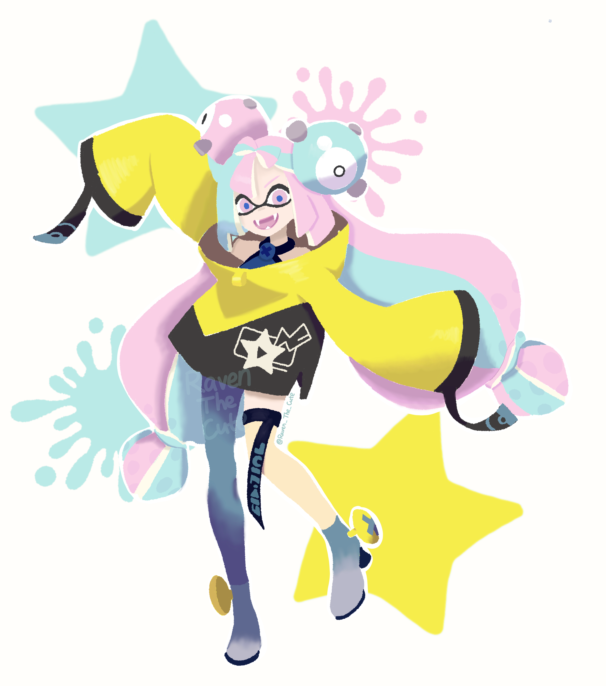

**[Apr 30, 2022] I am learning to use Procreate - just realized how powerful it is.**

A practice on how to use color picker and brush :) Drew the joker that I have been procrastinating since 2019. (May 1, 2022)

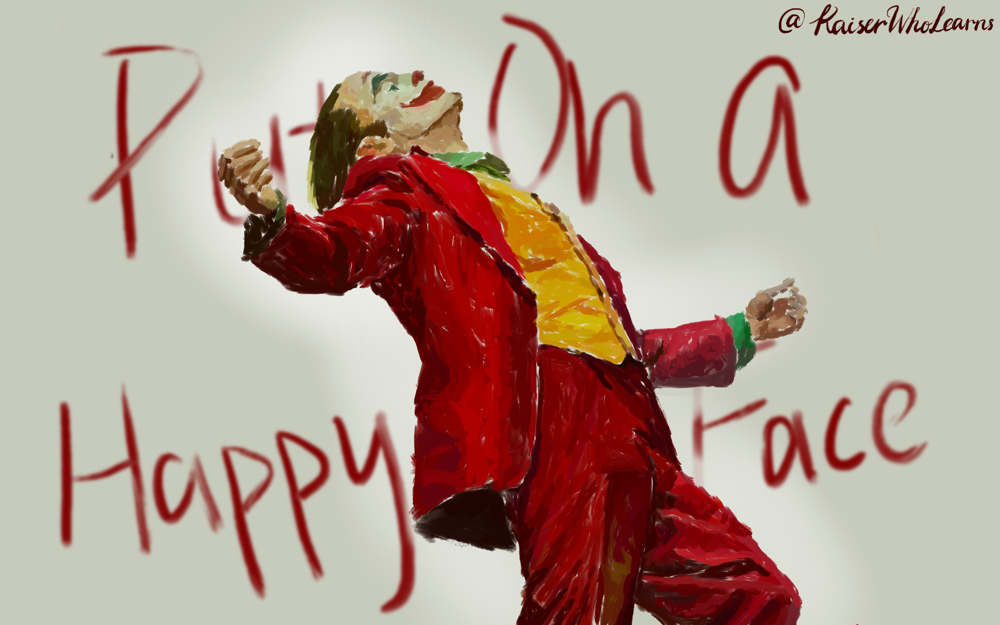

This is a drawing of my favorite 19th-century statue. My first try on slightly complex object on Procreate! (Apr 30, 2022)

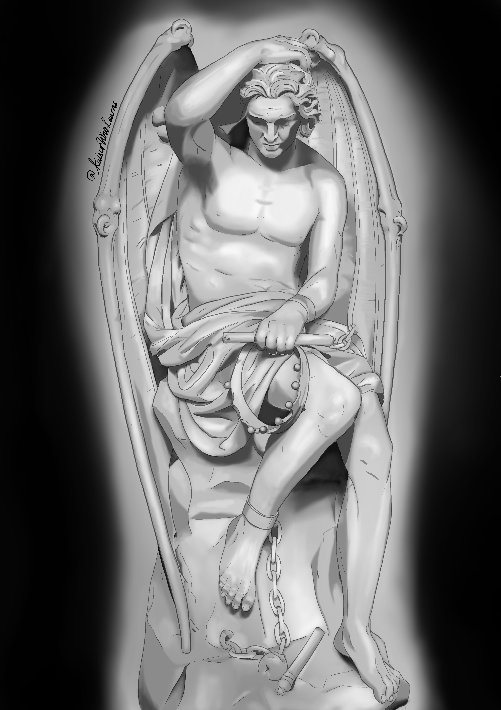

<!-- First attempt - my spouse and my profile pictures!

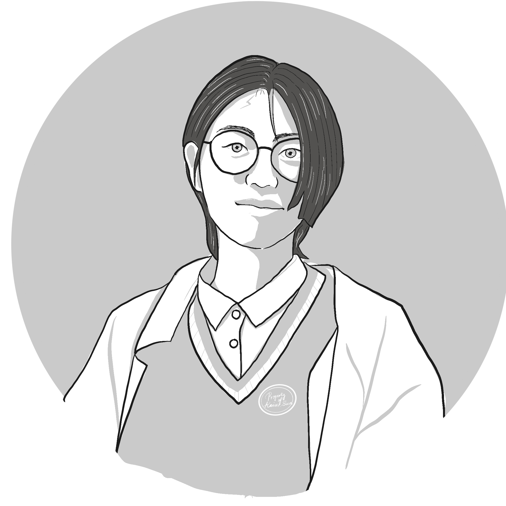
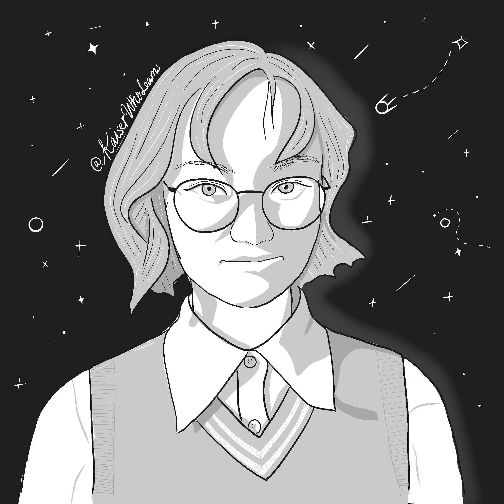

My friend's goose, which is very aggressive.

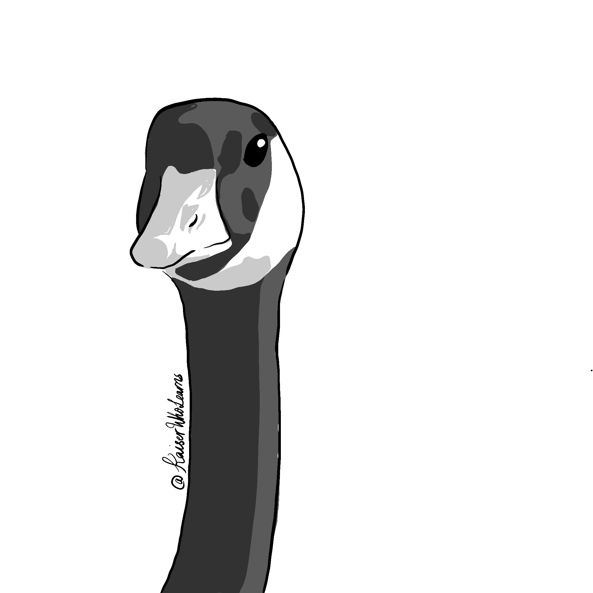 -->

**Some watercolor paintings from 2020 to 2021:**

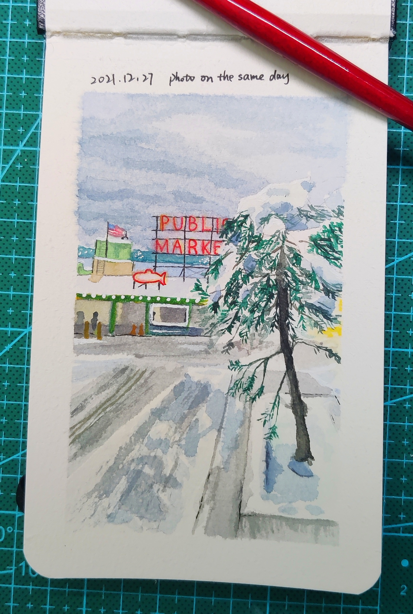

**Some colored pencil drawings beginning 2021 summer:**

**Some oil pastel paintings from 2019 to 2021:**

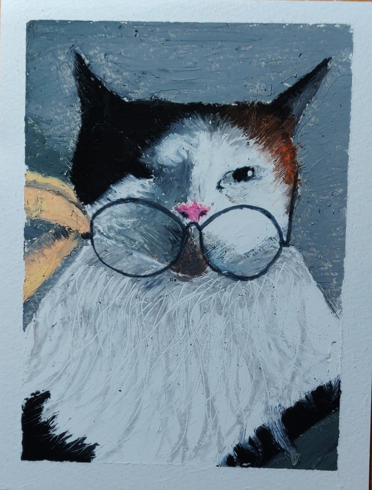
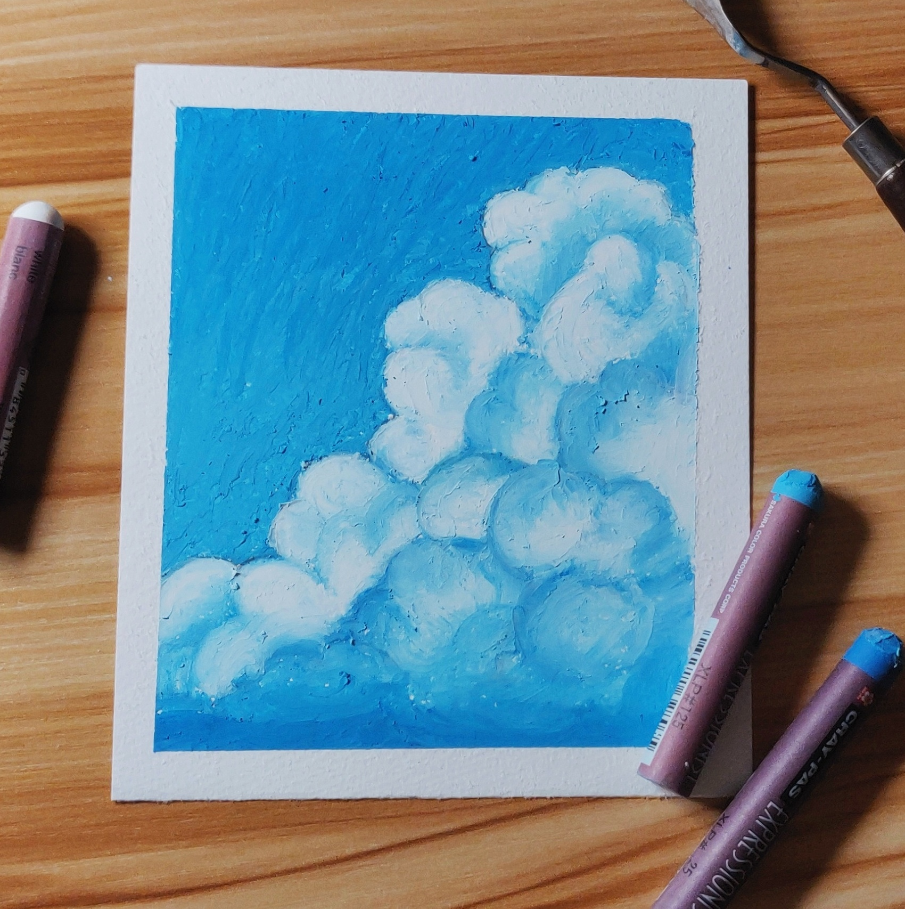

**Some collate art from 2021:**

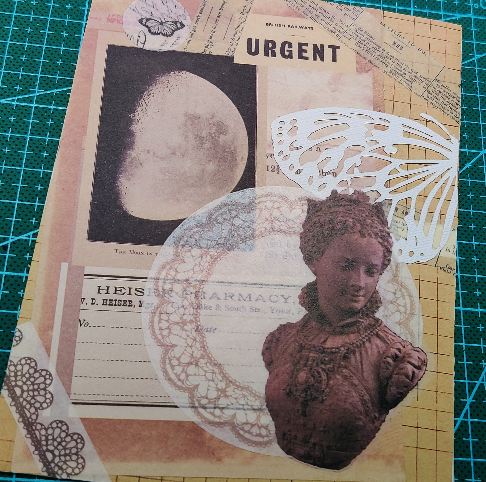

**Some paintings from 2019 to 2020:**

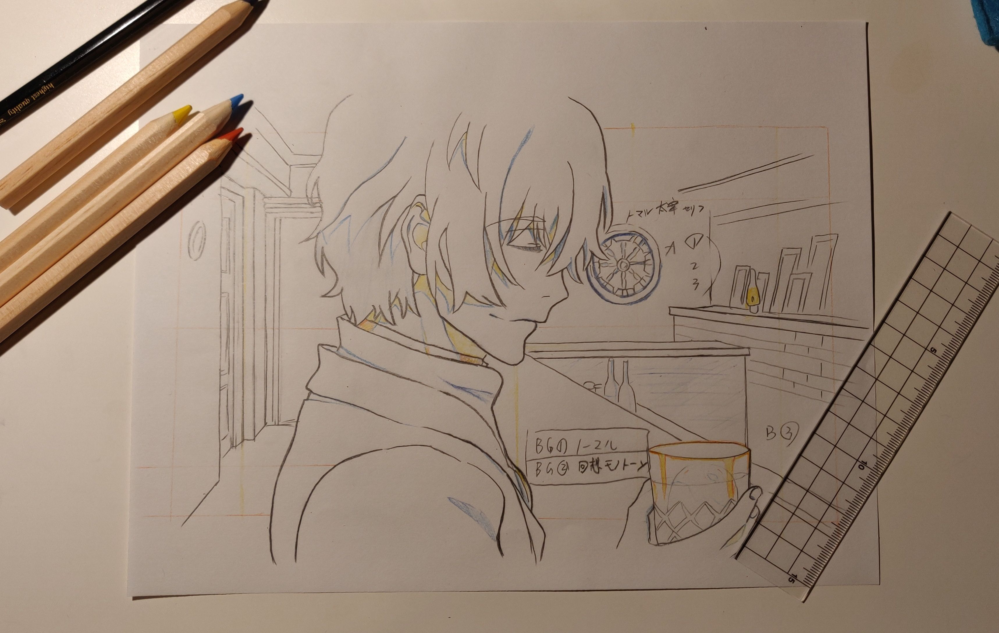
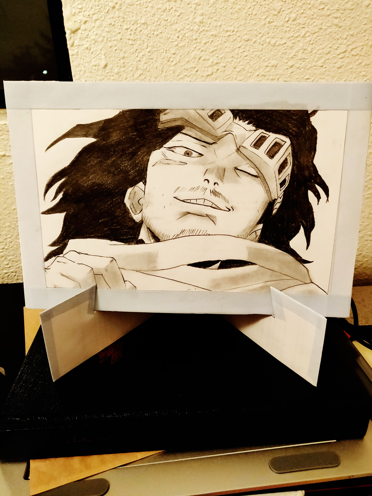

**Some watercolor characters inspired by [黄皮桑](https://www.pixiv.net/en/users/3251213):**

