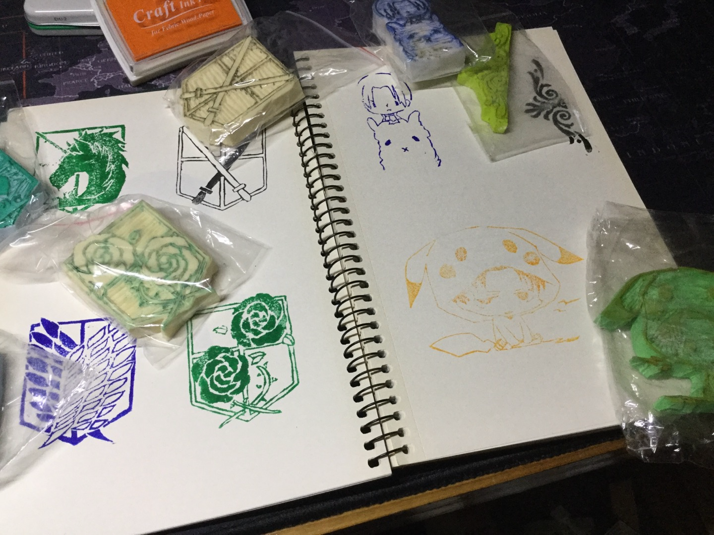
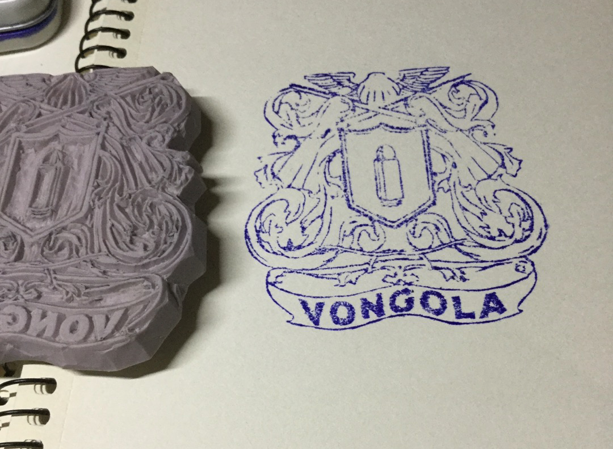

The thing I like most is to **create** things and play with different mediums. Many of the items I made or drew are from some video games, shows, or books I love. 

Some 3D prints (model built on my own if not specified).

Many attempts to make "acrylic" pedants from scratch, because I do not want to order a large batch of my printed art.

I play with clay, too.

I also carve stamps.

Paper cutting & Origami

Embroidery

