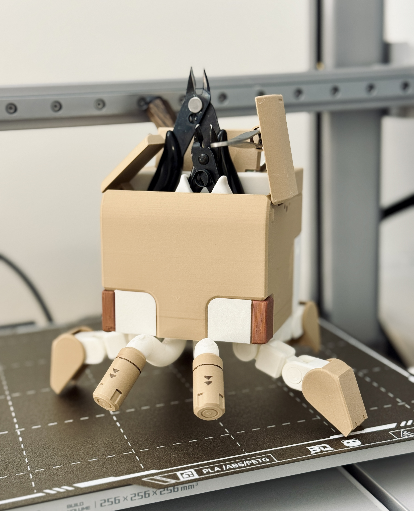
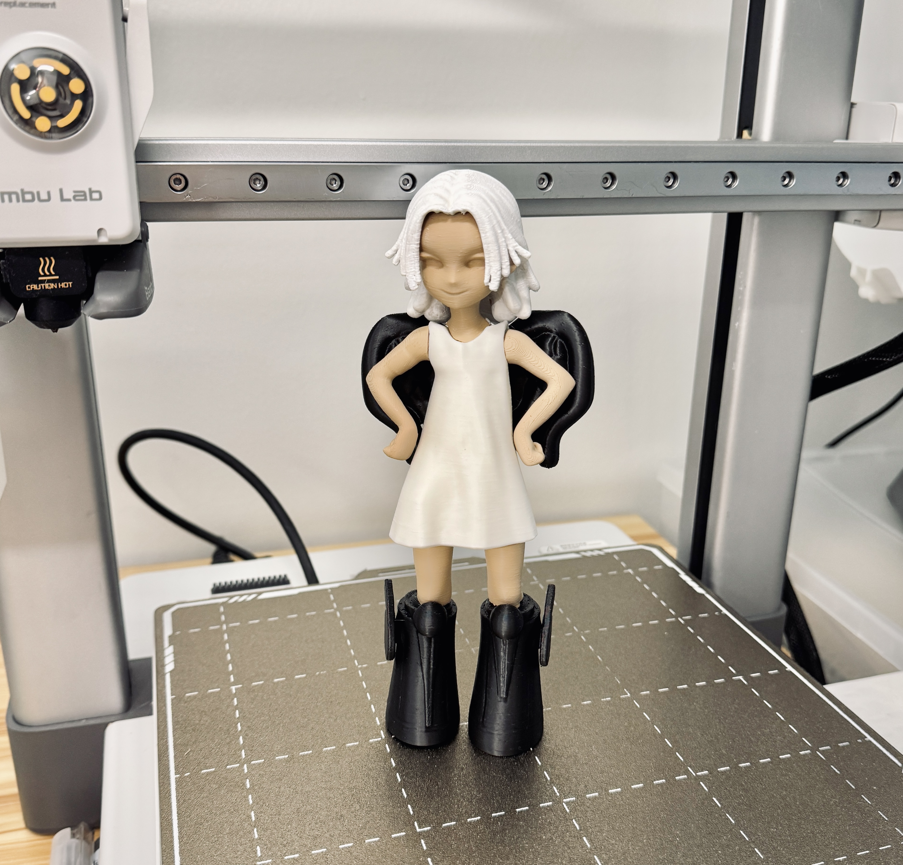
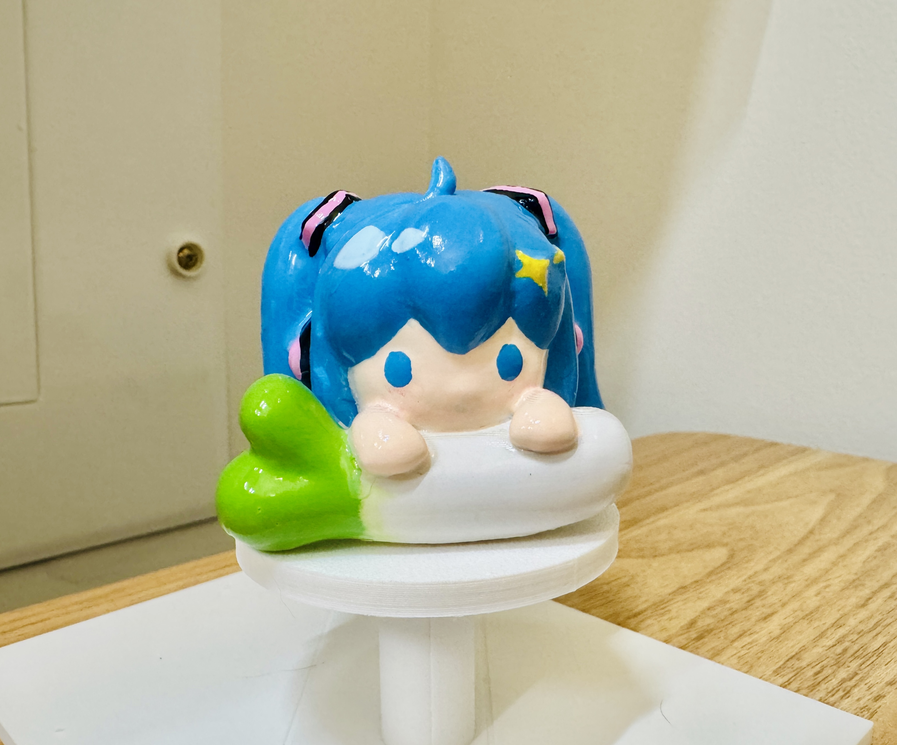
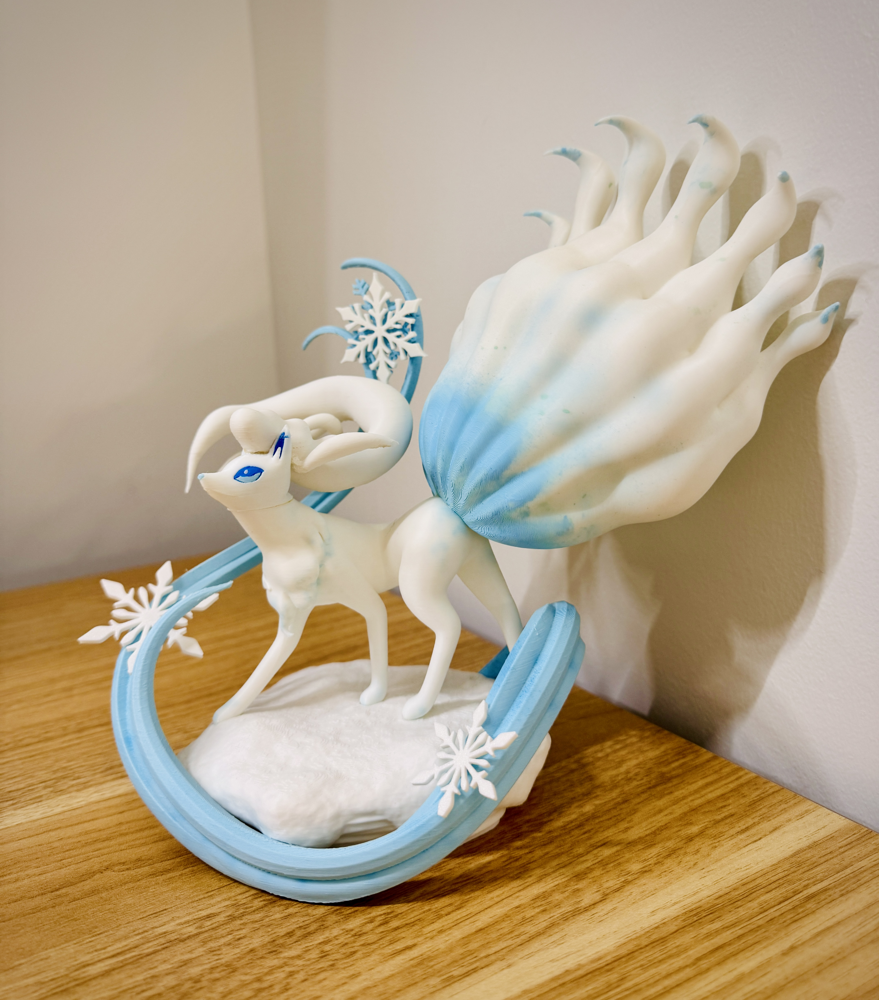
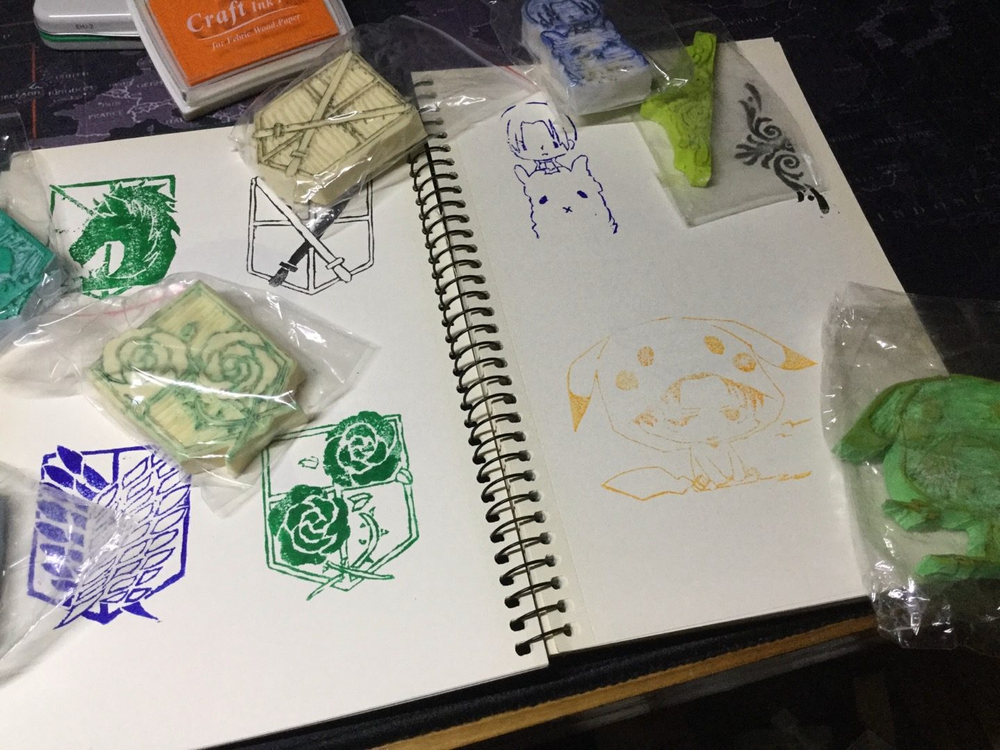
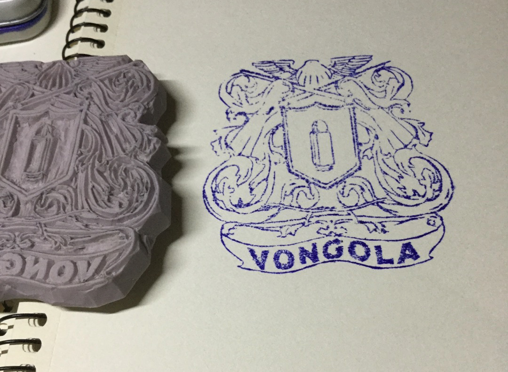

The thing I like most is to **create** things and play with different mediums. Many of the items I made or drew are from some video games, anime, or books I love.

  
<b>3D Prints & Gunpla</b>

  

    
    
    
    
    
    
    
    
    
    
  

  
<b>Acrylic Pendants</b>

  
Many attempts to make "acrylic" pendants from scratch, because I do not want to order a large batch of my printed art.

  

    
    
    
    
    
  

  
<b>Clay</b>

  

    
    
    
    
  

  
<b>Stamp Carving</b>

  

    
    
    
    
  

  
<b>Paper Cutting & Origami</b>

  

    
    
  

  
<b>Embroidery</b>

  

    
    
  

