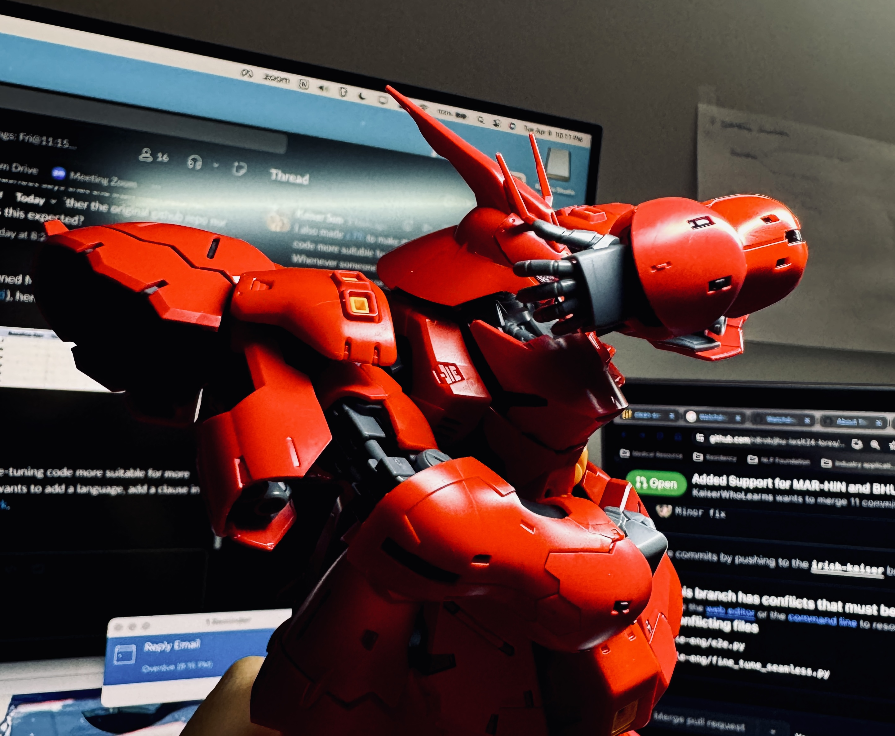
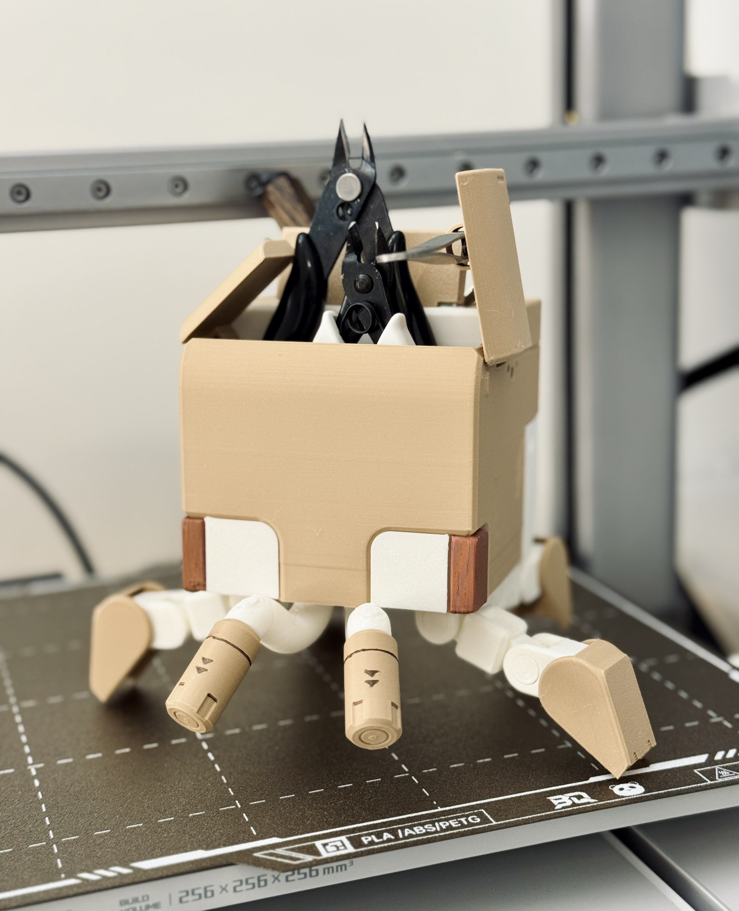
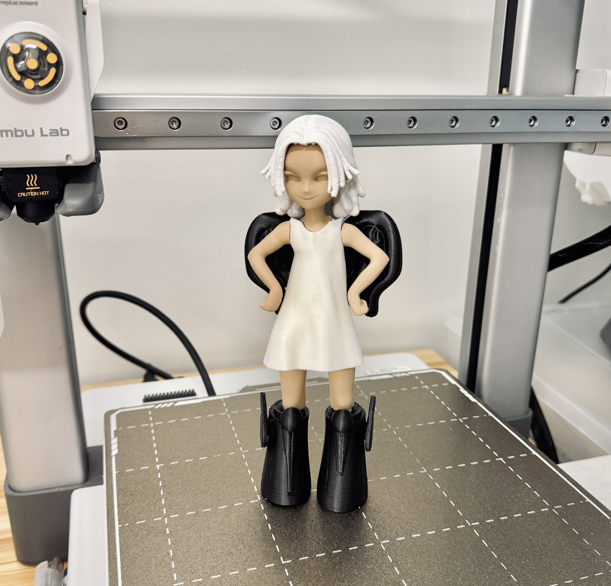
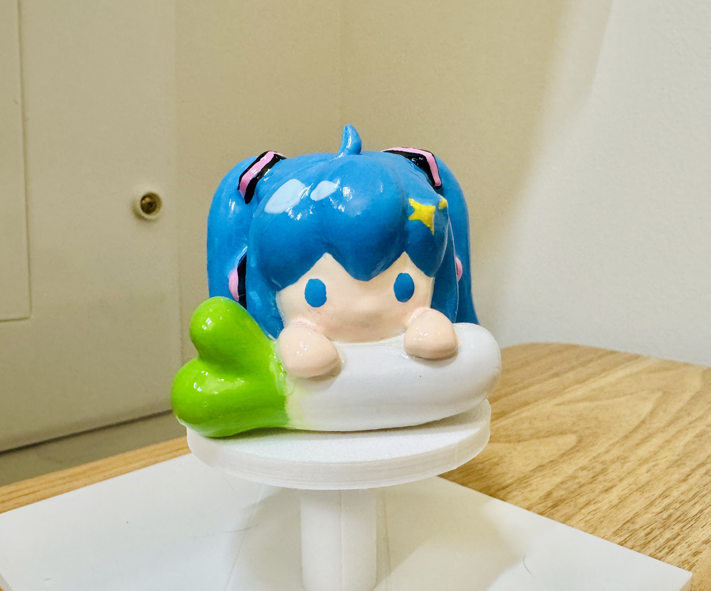
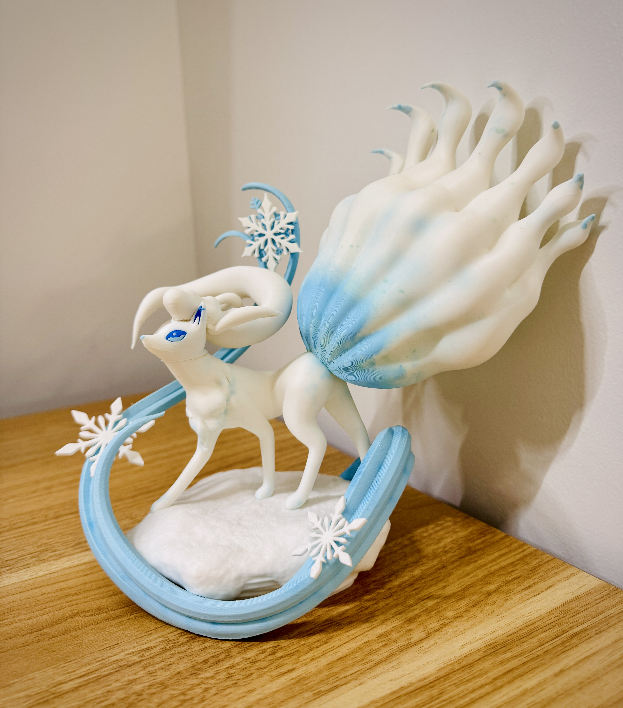

The thing I like most is to **create** things and play with different mediums. Many of the items I made or drew are from some video games, anime, or books I love. 

  
<b>Some 3D prints and Gunplas.</b>

 

  
<b>Many attempts to make "acrylic" pedants from scratch, because I do not want to order a large batch of my printed art.</b>

 

  
<b>I play with clay, too.</b>

 

  
<b>I also carve stamps.</b>

 

  
<b>Paper cutting & Origami</b>

 

  
<b>Embroidery</b>

 
