### I like making bentos...

my day becomes better when I open my bento in office and such a beautiful layout of food comes into my sight.

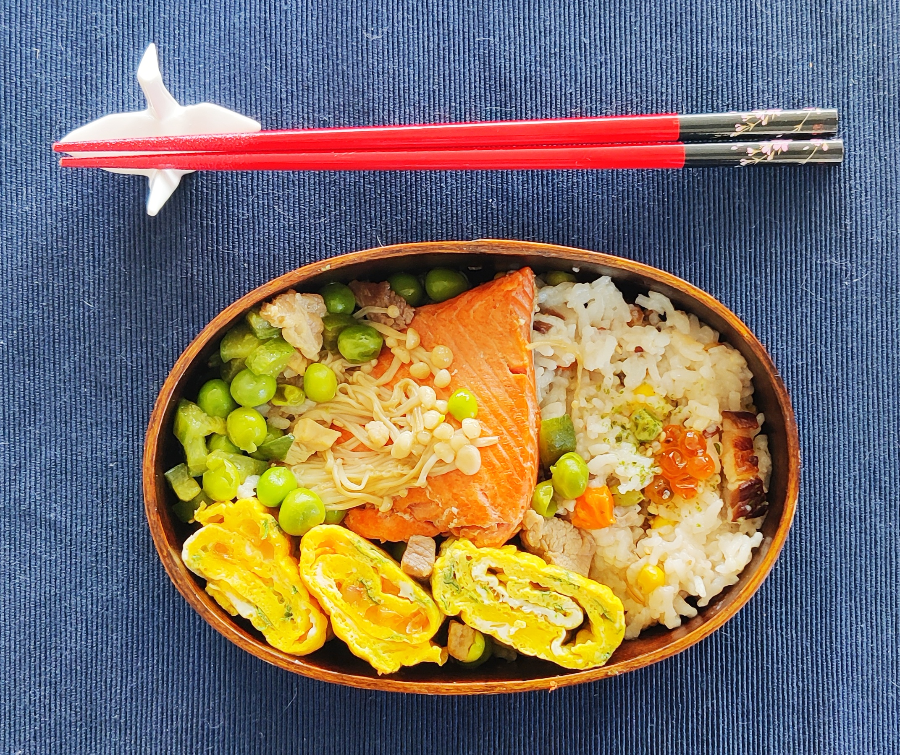
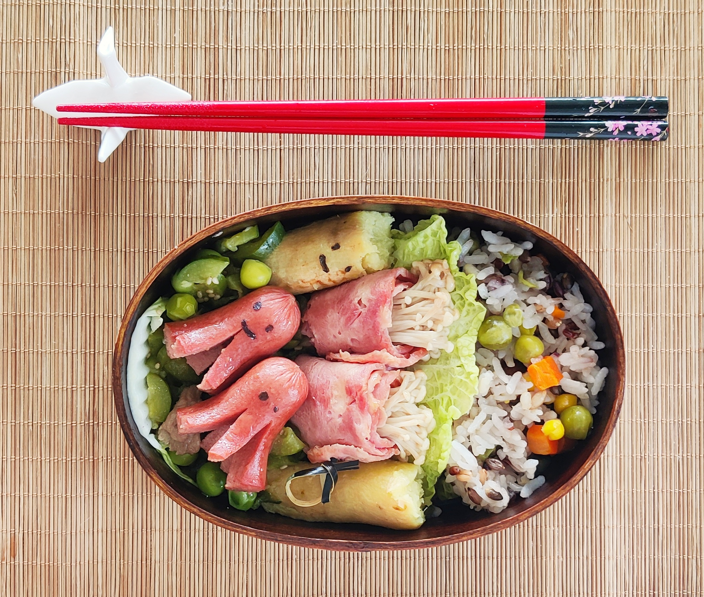
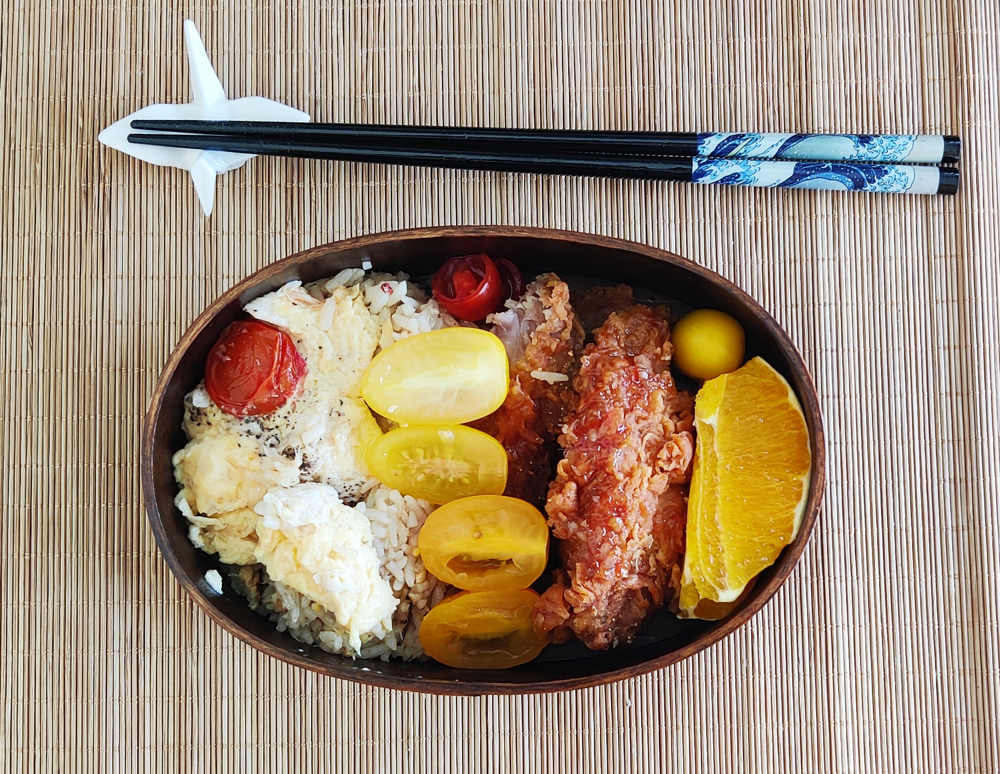

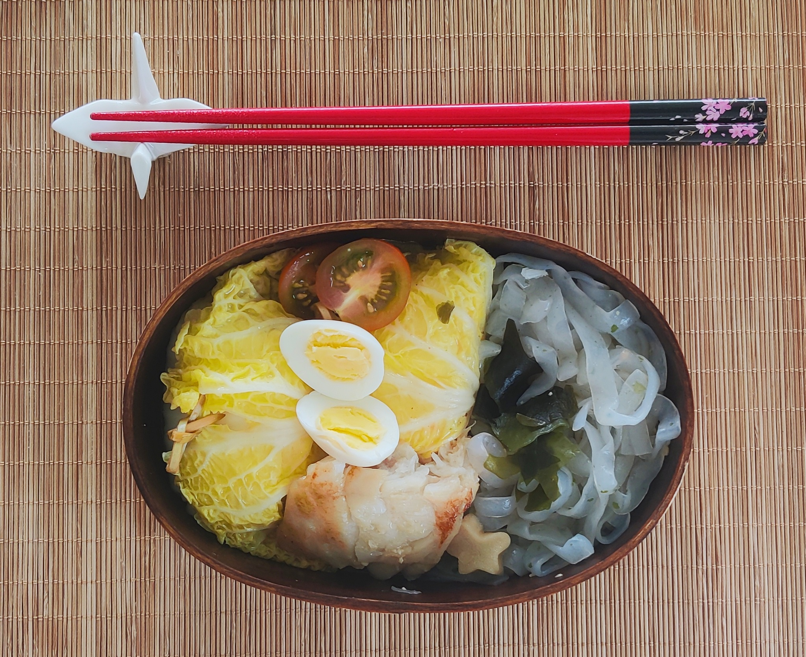
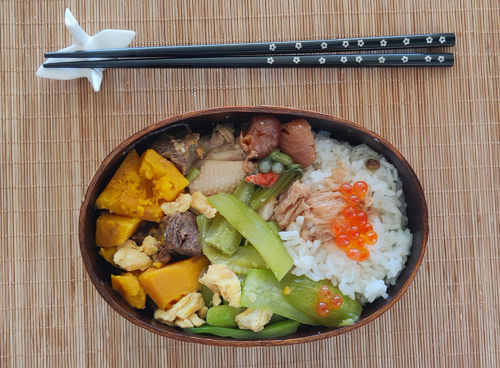

### I make a lot of desserts!

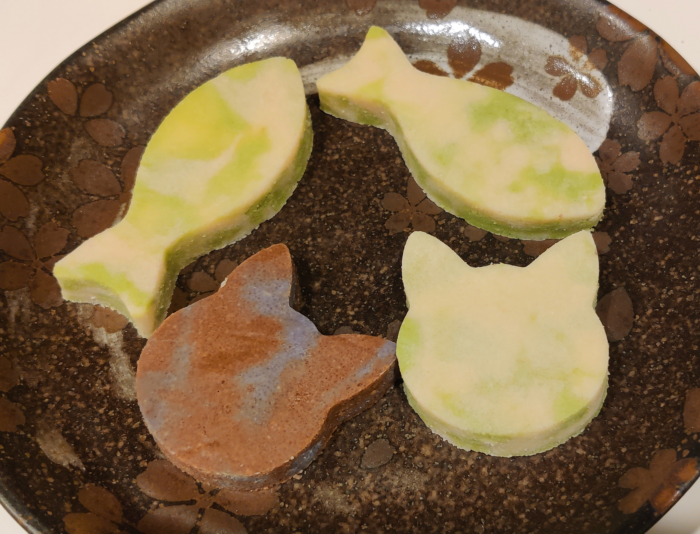
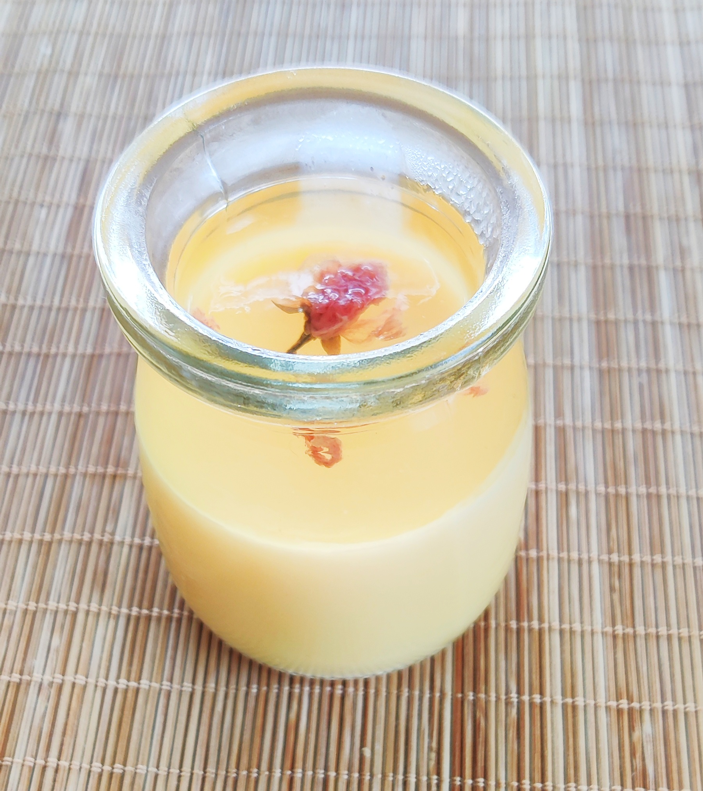

### Other dishes...
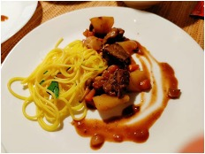
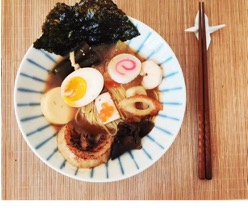
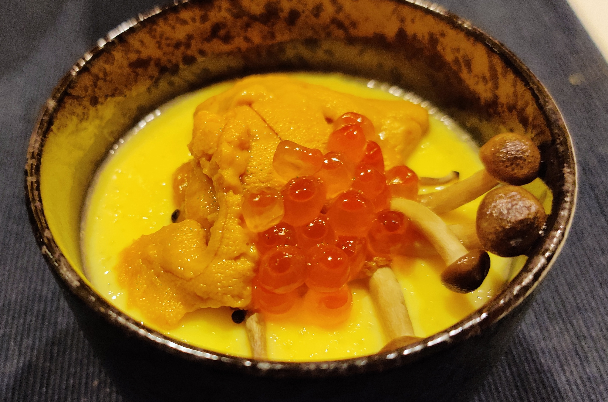

### I like making cha-kaiseki, too.

(Although in some image it's actually the soup that occupies the role of tea, and I didn't really have guests for these :))

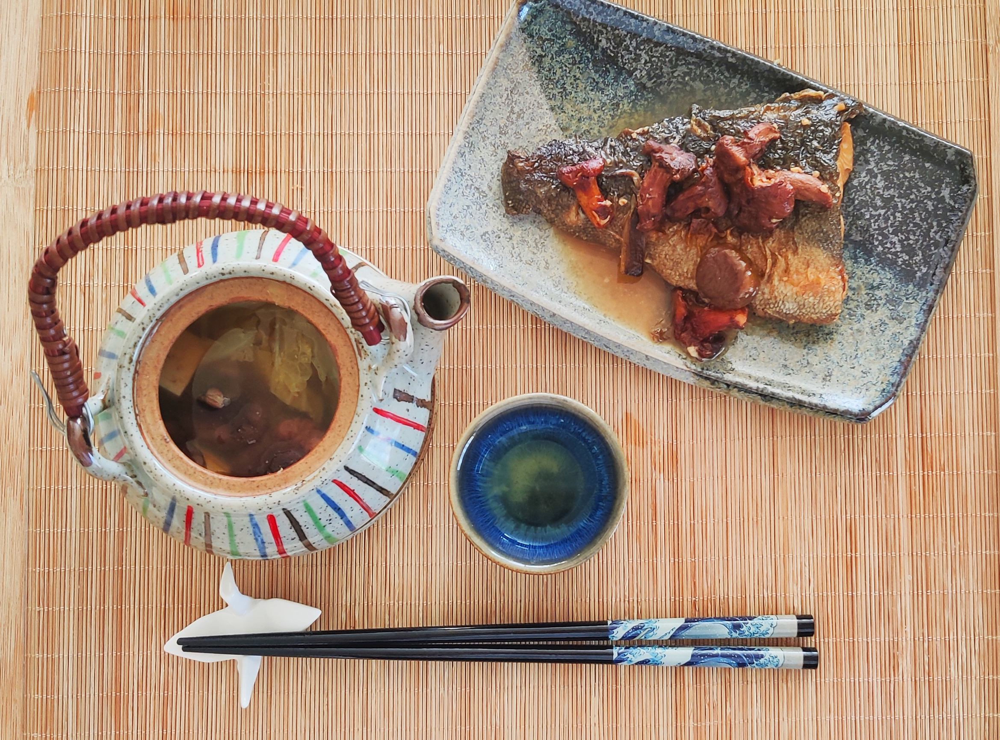
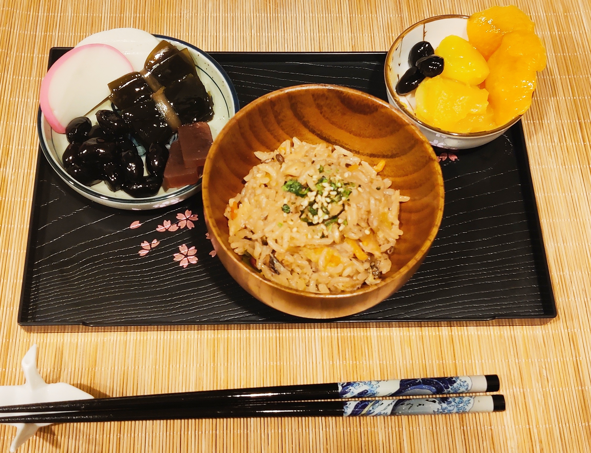

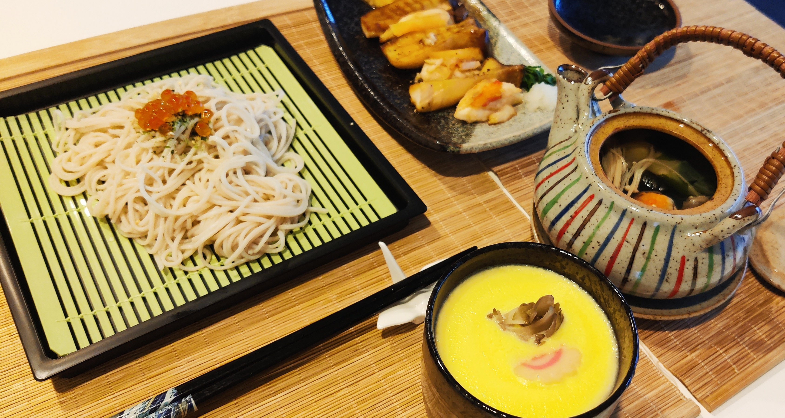
