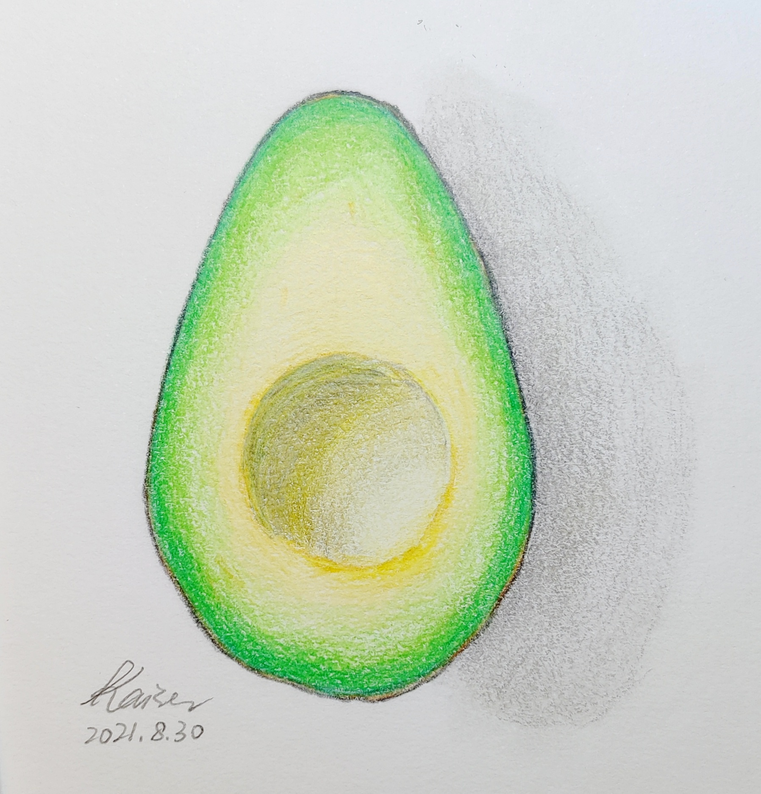
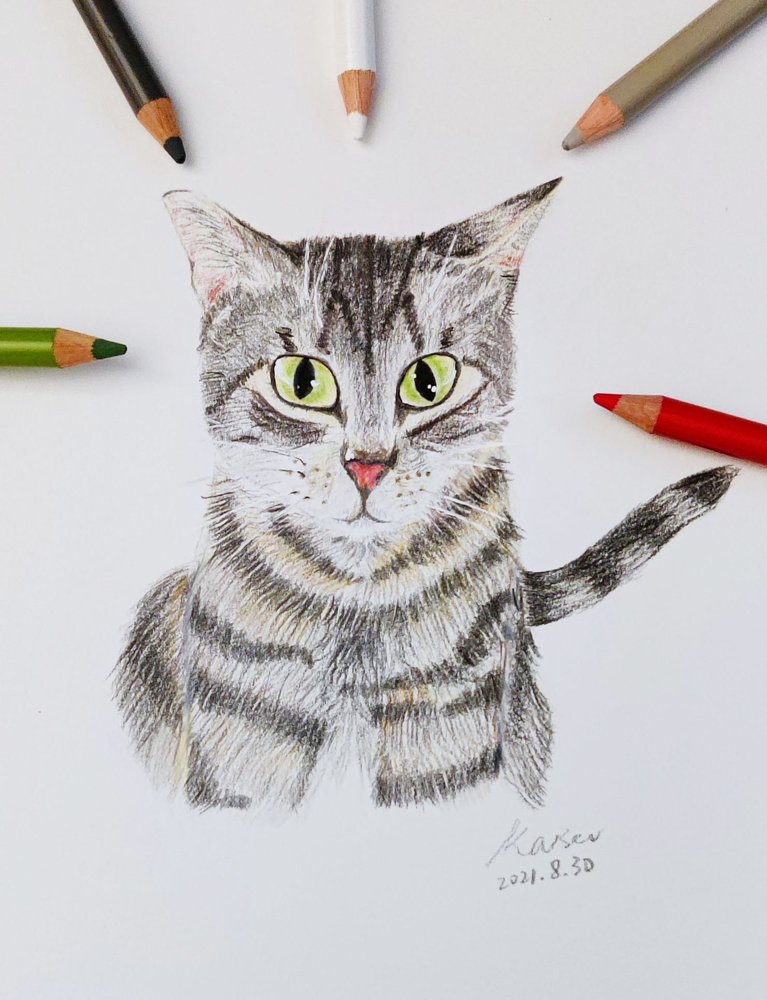
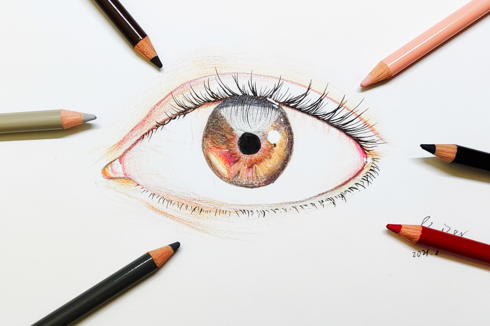

I live in Seattle with my patner and two cats, Bert and Roberta. In my free time, I like *photography* (with phone since I am a broken college student), *caligraphy*, *collage art*, and *drawing, painting with colored pencils, watercolor, gouache, as well as oil pastels*.
### Some of my paintings



<figure>
    
    
    
    <figcaption>Some colored pencil drawings beginning 2021 summer</figcaption>
  </figure>

### Some of my photos